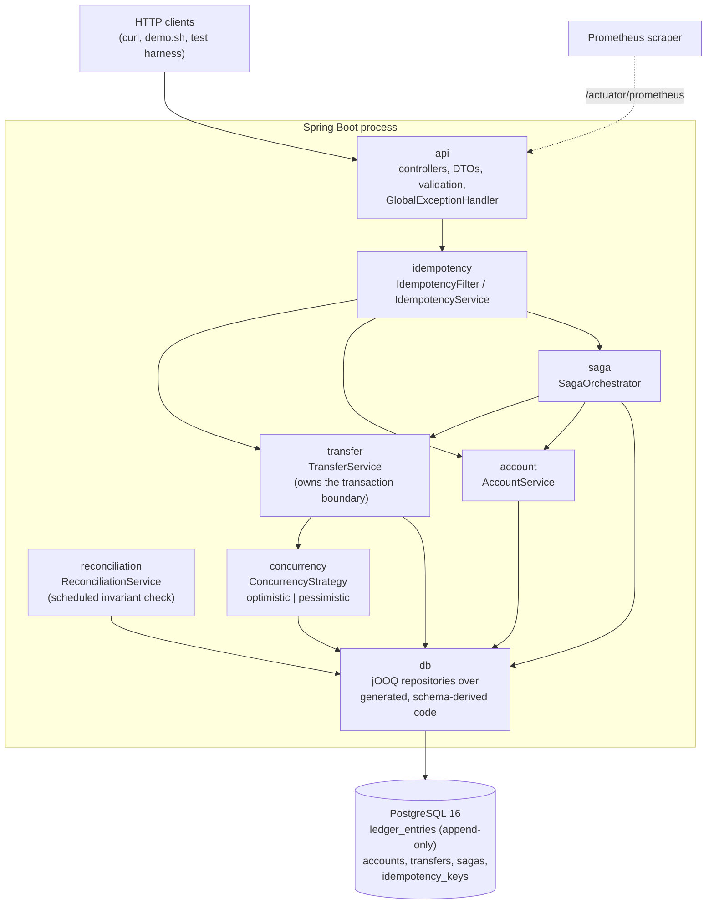

# Payments Ledger

A double-entry payments ledger REST API in **Java 21 + Spring Boot 3 + jOOQ + PostgreSQL**.
Correctness under concurrency and crashes is the deliverable, proven by a repeatable chaos harness
— not a features list.

---

## The headline result

> **10,079 requests fired, 7,700 unique transfers applied, 2,360 duplicate (idempotent) requests
> against 4 hot accounts, 12 saga crashes injected mid-flight → 0 double-charges, 0 money created
> or destroyed, Σ(ledger_entries) = 0, every account balance reconciled to its entry sum.**

That is a real run, pessimistic strategy (the production default), captured verbatim below — not
an invented number.

```
┌─ CONCURRENCY & CHAOS HARNESS ─ strategy=pessimistic ─ seed=20260722 ─────────
  Requests fired                    10,079    wall clock                    0m 13s
  Unique transfers applied           7,700    client re-sends               19
  Duplicate requests detected        2,360    max in-flight                 256
  Double-charges                         0   ✔
  Money delta                             0   ✔  (pre 1000000000000 -> post 1000000000000)
  Σ(ledger_entries)                      0   ✔
  Accounts below min_balance             0   ✔
  Sagas crashed / recovered      12 / 12  ✔  (terminal: 4 COMPLETED, 8 COMPENSATED)
  Reconciliation drift           genesis only ✔
  INVARIANT STATUS               PASS
└──────────────────────────────────────────────────────────────────────────────┘
```

**Reproduce it yourself in two commands:**

```bash
make up               # builds the jar, starts app + Postgres
make concurrency-test  # runs the harness above against it
```

`make concurrency-test-x10` repeats it 10 consecutive times — the repeatability gate this project
holds itself to (NFR-1).

---

## Architecture

Single-process REST API, one PostgreSQL database. No message broker, no distributed transaction
coordinator, no cache, no read replica — nothing that doesn't serve the correctness proof.



The one invariant every design decision either enforces or is justified by not threatening:

```
Σ(amount_minor × direction_sign for ALL ledger_entries) = 0   at all times
```

---

## Results

### Concurrency & crash harness (SPEC 0007)

| Metric | Pessimistic (prod default) | Optimistic |
|---|---|---|
| Requests fired | 10,079 | 10,731 |
| Unique transfers applied | 7,700 | 7,700 |
| Duplicate requests detected | 2,360 | 2,360 |
| Client re-sends (retry exhaustion) | 19 | 671 |
| Double-charges | 0 | 0 |
| Money delta (pre → post) | 0 | 0 |
| Σ(ledger_entries) | 0 | 0 |
| Accounts below min_balance | 0 | 0 |
| Sagas crashed / recovered | 12 / 12 (4 COMPLETED, 8 COMPENSATED) | 12 / 12 (4 COMPLETED, 8 COMPENSATED) |
| Invariant status | **PASS** | **PASS** |

Optimistic shows far more client re-sends under identical load — exactly the cost of racing on a
version compare-and-set instead of taking a row lock upfront, and the reason ADR 0006 / ADR 0010
picked pessimistic as the production default under read-committed.

### Throughput benchmark (SPEC 0008, JMH — `docs/bench/results.md`)

Full 2×2×7 matrix (strategy × isolation × contention 1–64 threads/hot-account); highlights:

| | read_committed | serializable |
|---|---|---|
| **Pessimistic peak** | 858.7 transfers/sec @ contention 16 (p99 35 ms) | — |
| **Optimistic peak** | 336.7 transfers/sec @ contention 1 | 569.3 transfers/sec @ contention 2 (p99 61 ms) |
| **Crossover** | pessimistic overtakes optimistic at contention 1 and stays ahead | pessimistic overtakes at contention 32 |
| **SERIALIZABLE cost vs read_committed** | — | optimistic −0.3%, pessimistic **−61.4%** |

Pessimistic wins or ties at every measured contention level under read-committed; SERIALIZABLE
costs pessimistic 61.4% average throughput for a write-skew hazard this access pattern doesn't
have (ADR 0001) — the full measurement-driven argument is ADR 0010.

---

## Architecture Decision Records

| ADR | Decision |
|---|---|
| [0001](docs/adr/0001-isolation-level.md) | READ COMMITTED + explicit row locking, not SERIALIZABLE by default |
| [0002](docs/adr/0002-jooq-codegen.md) | jOOQ code generated from a real, migrated Postgres via Testcontainers at build time, never committed |
| [0003](docs/adr/0003-api-authentication.md) | API-key authentication scheme |
| [0004](docs/adr/0004-cursor-pagination-and-openapi-source.md) | Cursor pagination; controllers/DTOs are the OpenAPI source of truth |
| [0005](docs/adr/0005-idempotency-via-unique-constraint.md) | Idempotency via a unique-constraint claim, not an application lock |
| [0006](docs/adr/0006-optimistic-vs-pessimistic.md) | Both locking strategies implemented and selectable; bounded retry loop outside the transaction |
| [0007](docs/adr/0007-reconciliation-report-only.md) | Reconciliation only reports drift; the entry sum is always authoritative, never "corrected" automatically |
| [0008](docs/adr/0008-saga-leg-model.md) | Chain-of-legs saga model with a single reusable `LegTransferStep` |
| [0009](docs/adr/0009-retry-exhaustion-is-not-a-terminal-idempotency-outcome.md) | 409 retry-exhaustion marks an idempotency key FAILED, not COMPLETED |
| [0010](docs/adr/0010-concurrency-strategy-and-isolation-by-measurement.md) | Pessimistic + read-committed chosen as the production default, by measurement |
| [0011](docs/adr/0011-single-stage-image-and-host-built-jar.md) | Single-stage runtime image with a host-built jar — jOOQ codegen needs Docker at build time, so a build stage can't run inside `docker build` |

---

## Reproduce it yourself

**Prerequisites:** Docker, JDK 21.

```bash
make up                  # mvn package (needs Docker for jOOQ codegen) + docker compose up
make test                 # full unit + integration suite, real Postgres via Testcontainers
make concurrency-test      # the headline result above
make concurrency-test-x10  # repeatability gate: 10 consecutive passes
make bench                 # JMH throughput/latency matrix -> docs/bench/
./demo.sh                  # end-to-end curl walkthrough: transfer, idempotent replay, Σ=0
```

Once the stack is up:
- `http://localhost:8080/swagger-ui.html` — interactive API docs
- `http://localhost:8080/actuator/prometheus` — live metrics (`ledger_transfers_total`,
  `ledger_transfer_conflicts_total`, `ledger_sagas_total`, `reconciliation_*`)

---

## The spec-driven workflow

Nothing here was built without a spec first. The loop, every time:

1. **Spec** (`specs/`) — scope, requirements, acceptance criteria, status `draft → approved →
   implemented → verified`.
2. **ADR** (`docs/adr/`) — isolation level, locking strategy, saga design: recorded *before* the
   code that depends on it merges.
3. **Failing test first**, real PostgreSQL via Testcontainers — H2/in-memory databases are
   prohibited for anything touching transactional correctness.
4. **Implement to green.**
5. **Progress entry** (`progress_report.md`) — appended after every meaningful change, failures
   included: what broke, why, how it was fixed.

Guardrails enforcing this mechanically, in `.claude/hooks/`:
- `block-float-money` — rejects `float`/`double`/`BigDecimal` for any monetary value.
- `gate-commit` — blocks commits without a clean build/test/invariant-check pass.

`.claude/skills/` holds the invocable workflows (`/spec-new`, `/adr-new`, `/progress-log`, the
`/invariant-check` that re-derives Σ(entries) = 0 and per-account balance = Σ(its entries) on
demand). `progress_report.md` is the append-only running story of the whole build — what was
tried, what broke, and how each problem was actually solved.
